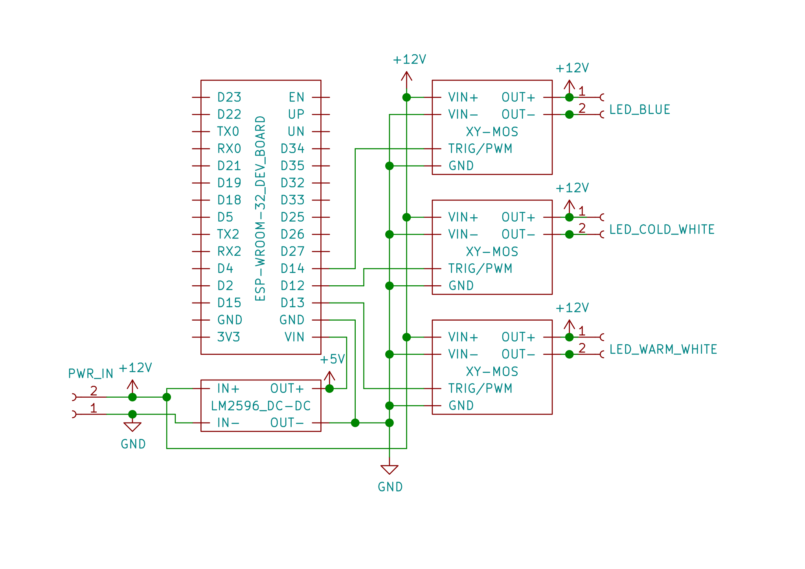
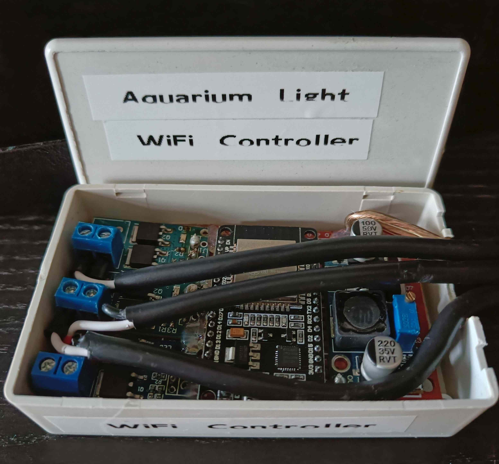
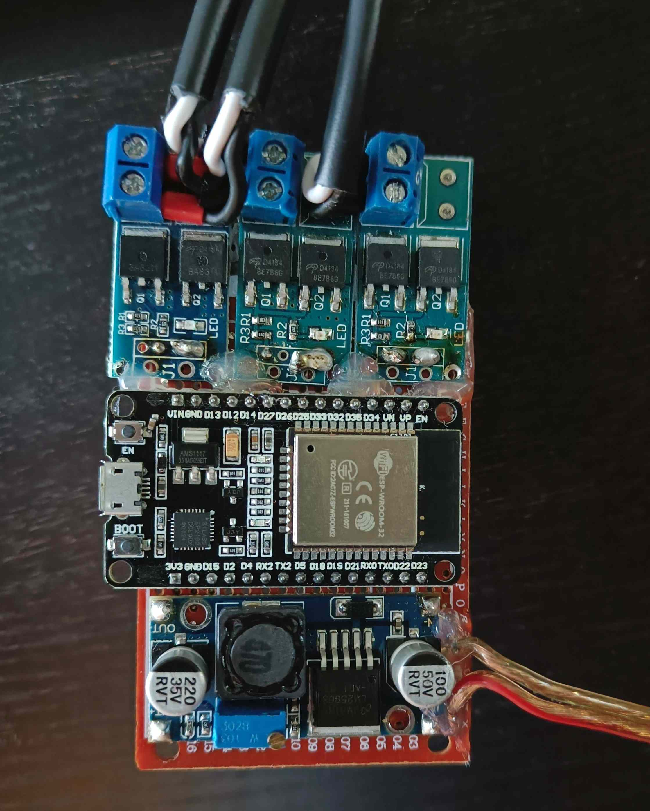

# Aquarium Light

To use the <a href="#/pages/projects/wifi_controller/readme.html">WiFi Controller</a> project for aquarium lights I slightly modified the [wifi_controller main git branch ](https://github.com/lm4552/wifi_controller/tree/master) and placed it in a new [aquarium_light git branch ](https://github.com/lm4552/wifi_controller/tree/aquarium_light).
For aquarium lights each GPIO channel of the controller gets attached to a specific LED channel by an XY-MOS module. The hardware setup, schematic, customized webinterface and more are shown below. 

[See project on GitHub](https://github.com/lm4552/wifi_controller/tree/aquarium_light)

## Webinterface

*available soon*

## Schematic 

 

## Images

||
|---|
|Hardware inside the case|

||
|---|
|Circuit with all modules wired up|

