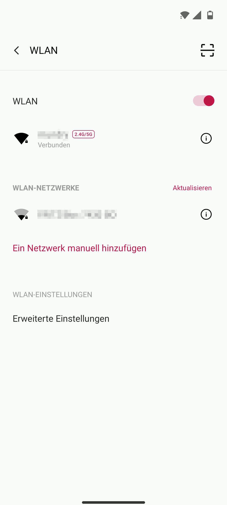
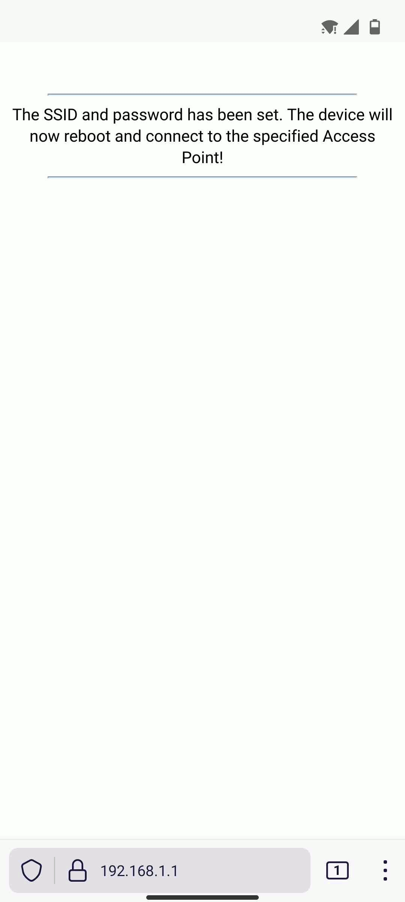

# WiFi Controller

This a generic project to control GPIOs of an ESP32 development board from a webinterface. It allows to schedule time intervals per GPIO channel in different operating modes: 

- The current operating modes allow to dimm and control devices via PWM, as well as disabling and enabling channels completely. 

- Intervals can be repeated at arbitrary time intervals. 

- Its also possible to define maximum values for PWM channels. 

- The settings are always saved to the flash of the ESP32 and will be recovered in case of a power failure. 

- In addition to that, the WiFI configuration of the ESP32 will by default be configured in Access Point(AP) mode. After connecting to the WiFI Controller AP and setting the SSID and password, it will automatically reboot and make the webinterface available to the local network. 

The project uses a simple REST API which uses HTTPS POST and GET requests to exchange JSON objects. For SSL/TLS a self signed certificate is used which is generated by the Makefile. The certificate can be changed by replacing the generated one.   

The project is based on an old project which I completely refactored. Therefore, I removed some functionality but also added certain new features. I mainly used the old project for controlling different LED channels of aquarium lights via WiFi. However the code can be used for various applications: 

- As mentioned before, the project can be used for aquarium lights, where each GPIO channel gets attached to a specific LED channel.  The hardware setup, schematic, customized webinterface and more are shown on my <a href="#/pages/projects/aquarium_light/readme.html">Aquarium Light</a> project page. There is also a [aquarium_light git branch ](https://github.com/lm4552/wifi_controller/tree/aquarium_light) for this application.

- I am planning to provide a branch for a doser pump, too.

[See project on GitHub](https://github.com/lm4552/wifi_controller)

### Illustration

||
|---|
|Configuration of the ESP32 WiFi settings in AP mode|

||
|---|
|Configuration of intervals and channels via the WiFi that was configured in AP mode|

 
