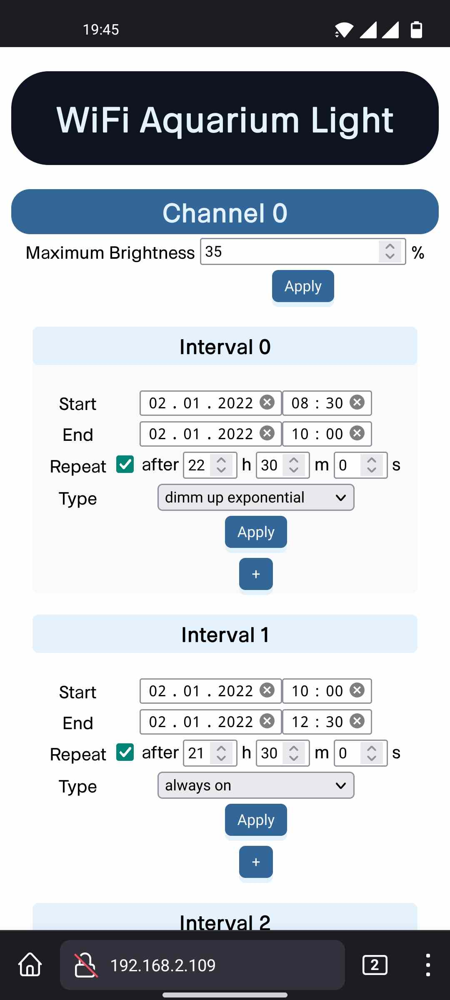

# Aquarium Light

For using the <a href="#/pages/projects/wifi_controller/readme.html">WiFi Controller</a> project for aquarium lights I slightly modified the [wifi_conroller main git branch ](https://github.com/lm4552/wifi_controller/tree/aquarium_light) and placed it in a new [aquarium_light git branch ](https://github.com/lm4552/wifi_controller/tree/aquarium_light).
You can also find some details about the hardware here.

## Webinterface

available soon

## Schematic 

 

## Images

||
|---|
|Hardware inside the case|

||
|---|
|Circuit with all modules wired up|

